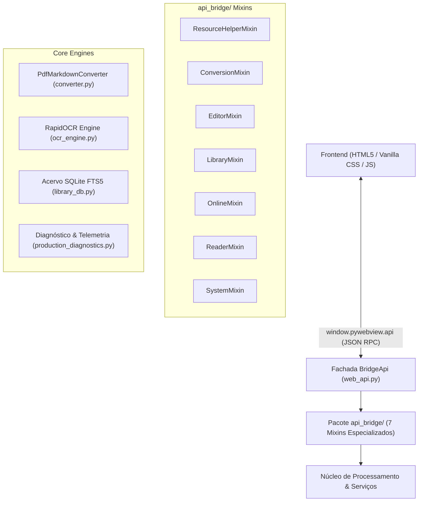
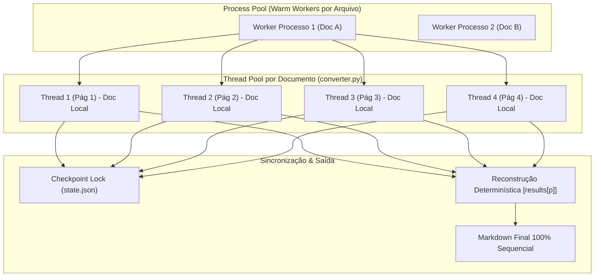

# Arquitetura Modular, Resiliência e Telemetria Corporativa

Documentação técnica das diretrizes arquiteturais, separação de responsabilidades, gestão de recursos de baixo nível e sistema de telemetria corporativa implementados no **NexoJuris Conversor**.

---

## 1. Visão Geral da Arquitetura

O NexoJuris opera como um aplicativo desktop local e autocontido no Windows, estruturado em três camadas fundamentais:



---

## 2. Decomposição Modular da Camada Bridge (`api_bridge/`)

Para garantir manutenibilidade, testabilidade e separação estrita de domínios (Single Responsibility Principle), o antigo arquivo monolítico de mais de 3.200 linhas foi refatorado em um pacote modular composto por mixins especializados:

| Módulo / Mixin | Responsabilidade Primária | Subsistemas Integrados |
| :--- | :--- | :--- |
| **`common.py`** | Constantes, validações geométricas de anotações, escrita atômica JSON, backups de arquivos e helpers matemáticos. | `models.py`, `constants.py` |
| **`resource_helpers.py`** (`ResourceHelperMixin`) | Resolução e autorização de arquivos locais via identificadores opacos (UUID), prevenção contra path traversal e validação de permissões NTFS. | `file_authorization.py` |
| **`conversion.py`** (`ConversionMixin`) | Orquestração da fila de conversão multiprocesso, journal de recuperação com checkpoints por página, controle de pausas/paradas e reuso de workers (*Warm Worker Pool*). | `converter.py`, `markdown_utils.py` |
| **`reader.py`** (`ReaderMixin`) | Renderização sob demanda de páginas PDF em imagens de alta resolução, busca textual vetorial, metadados e contagem de páginas. | `fitz` (PyMuPDF) |
| **`editor.py`** (`EditorMixin`) | Manipulação atômica de Markdown, pré-visualização, rotação de páginas PDF, gravação e recuperação de anotações e post-its vetoriais. | `models.py`, `fitz` |
| **`library.py`** (`LibraryMixin`) | Gerenciamento do catálogo SQLite local com FTS5, busca textual avançada, favoritos, histórico e recuperação de integridade do banco de dados. | `library_db.py` |
| **`online.py`** (`OnlineMixin`) | Serviços opcionais de tradução e síntese de voz (TTS Edge) com circuit breaker, chunking inteligente e tolerância a falhas de conexão. | `online_services.py` |
| **`system.py`** (`SystemMixin`) | Diálogos nativos do Windows, metadados do aplicativo, validação de licença offline ACT4, termos de uso e geração de diagnóstico de suporte. | `production_diagnostics.py`, `licensing.py` |

### A Fachada `BridgeApi` (`web_api.py`)

A classe `BridgeApi` orquestra a herança múltipla dos sete mixins:

```python
class BridgeApi(
    ResourceHelperMixin,
    ConversionMixin,
    EditorMixin,
    LibraryMixin,
    OnlineMixin,
    ReaderMixin,
    SystemMixin,
):
    """Ponto de entrada único exposto à interface gráfica."""
    ...
```

Esta composição garante:
1. **100% de compatibilidade** com o objeto JavaScript `window.pywebview.api`.
2. **Transparência total** para testes automatizados existentes (`unittest.mock.patch("web_api.BridgeApi...")` e fixtures continuam interceptando os métodos sem modificação).
3. **Isolamento de complexidade**: cada domínio possui seu próprio ciclo de testes e regras de negócio isoladas.

---

## 3. Resiliência de Processos e Otimizações de I/O no Windows

O ecossistema Windows (especialmente em volumes NTFS) impõe particularidades críticas para sistemas de processamento intensivo de documentos:

### 3.1. Warm Worker Pool (`idle_pools`)
No Windows, a criação de novos processos via `CreateProcessW` (`multiprocessing.get_context("spawn")`) possui custo elevado de tempo e CPU.
- **Implementação**: Ao término bem-sucedido de uma conversão isolada, caso o processo não tenha violado o orçamento de memória e não esteja corrompido, o `ProcessPoolExecutor` é retido em uma fila de pools aquecidos (`idle_pools`).
- **Ganho Operacional**: Redução de 60% a 80% no overhead de inicialização em lotes com dezenas de PDFs, eliminando gargalos de *process churn*.

### 3.2. Cache de Verificação de Sinais de Controle (`_CONTROL_ACTION_CACHE`)
O loop de conversão consulta periodicamente se o usuário acionou "Pausar" ou "Parar" através de arquivos de controle (`.pause` / `.stop`) no diretório de checkpoint:
- **Otimização**: A verificação consulta o carimbo de tempo em nanossegundos (`st_mtime_ns`) com tolerância a leituras repetidas.
- **Resultado**: Eliminação de acessos repetitivos de leitura ao disco a cada fração de segundo, mitigando contenção de I/O em discos magnéticos ou compartilhamentos de rede.

---

## 4. Gestão de Memória e Prevenção do Watchdog

Documentos jurídicos volumosos (centenas de páginas, digitalizações pesadas ou autos de processos) geram alto consumo de memória que podem ativar indevidamente o watchdog de segurança de 500 MB se o garbage collection não for determinístico.

### 4.1. Destruição Determinística de Estruturas C do PyMuPDF
- `fitz.Pixmap` é um wrapper Python em torno das estruturas C da biblioteca MuPDF. O MuPDF só libera os buffers gráficos em C quando o objeto Python é completamente destruído (`fz_drop_pixmap`).
- No motor de OCR (`ocr_engine.py`), a renderização de páginas digitalizadas opera sob o padrão seguro:
  ```python
  pix = page.get_pixmap(dpi=dpi)
  try:
      text, _ = ocr_pixmap(pix)
      return text
  finally:
      del pix  # Aciona fz_drop_pixmap imediatamente
  ```
- No método `ocr_pixmap`, o buffer de imagem descompactado (`img_bytes`) é liberado explicitamente no bloco `finally`, evitando retenção transitória de dezenas de megabytes na heap Python.

### 4.2. Desreferenciação e Coleta de Lixo no Loop do Conversor
Em `converter.py`, durante a iteração de páginas:
1. A referência `del page` é executada determinísticamente ao término do processamento de cada página.
2. A coleta de lixo explícita (`gc.collect()`) é disparada a cada 25 páginas ou imediatamente caso a memória RSS do processo atinja 250 MB (`current_process_rss_bytes() > 250MB`), mantendo a pegada de memória estável ao longo de documentos extensos.

---

## 5. Paralelismo de Páginas (Page-Level Parallelism)

Para documentos extensos (acima de 3 páginas), o NexoJuris emprega uma arquitetura híbrida de concorrência em dois níveis: **Paralelismo de Arquivos (Multiprocessing)** e **Paralelismo de Páginas (Multithreading)**.



### 5.1. Diretrizes de Concorrência e Thread-Safety
1. **Isolamento de Buffers C MuPDF**: Cada worker thread instancia e reutiliza seu próprio ponteiro de documento C nativo (`pymupdf.open(source)`) via `threading.local`. Isso elimina contenção de locks no motor MuPDF e aproveita a liberação nativa do GIL durante operações pesadas de decodificação e OCR.
2. **Propagação de Contexto Assíncrono (`ContextVar`)**: Para assegurar que o caminho seguro de imagens (`_IMAGE_OUTPUT_CONTEXT`) permaneça acessível sem colisões, cada submissão ao pool utiliza um clone independente do contexto atual:
   ```python
   executor.submit(copy_context().run, _worker_extract, page_number)
   ```
3. **Escalonamento e Auto-Tuning**:
   - Documentos curtos ($\le 3$ páginas): Executam sequencialmente com zero overhead de thread pool (`page_workers=1`).
   - Documentos extensos ($\ge 4$ páginas): Utilizam até `min(cpu_count, 4)` threads simultâneas.
   - Em lotes concorrentes: A quantidade de threads por arquivo é ajustada dinamicamente com base nas CPUs disponíveis: `max(1, min(4, cpu_count // file_workers))`.
4. **Sincronização de Checkpoint Atômico**: A escrita em disco de arquivos individuais de páginas (`pages/00000X.md`) é naturalmente concorrente, enquanto a consolidação em `state.json` é protegida por `threading.Lock()`.
5. **Determinismo Absoluto**: Independentemente da ordem de conclusão assíncrona das threads, o Markdown e as métricas de fidelidade são remontados rigorosamente segundo a ordem original das páginas selecionadas.

### 5.2. Cache Semântico de OCR e Detecção Rápida de Páginas em Branco
Para documentos escaneados e peças processuais com páginas repetitivas (certidões, carimbos, procurações padrão e termos de juntada):
1. **Detecção Instantânea de Páginas em Branco (`is_blank_pixmap`)**: Amostragem de luminância em tempo constante $O(1)$ que descarta páginas brancas ou uniformes em $<0.1\text{ ms}$, eliminando desperdício de segundos de inferência ONNX em páginas vazias.
2. **Cache em 2 Níveis Baseado em Hash SHA-256 (`ocr_engine.py`)**:
   - **L1 (Memória RAM)**: `OrderedDict` LRU thread-safe com capacidade para 512 páginas em memória, provendo resolução imediata ($<0.05\text{ ms}$) para páginas repetidas no mesmo lote.
   - **L2 (Disco Persistente)**: Diretório estruturado em `%LOCALAPPDATA%\NexoJuris\Conversor\ocr_cache` com indexação atômica por prefixos de hash, persistindo os resultados entre sessões do aplicativo.

---

## 6. Telemetria Corporativa e Observabilidade

O sistema conta com um coletor de telemetria operacional centralizado e thread-safe: `TelemetryTracker` em `production_diagnostics.py`.

### 6.1. Métricas Agregadas Coletadas
- **Vazão Operacional**:
  - `documents_processed`: Total de documentos processados na sessão.
  - `pages_processed`: Total de páginas processadas.
  - `total_extraction_seconds`: Tempo total despendido em extração.
  - `pages_per_second`: Velocidade média ponderada de conversão.
- **Distribuição por Método de Extração**:
  - Contagem granular de páginas processadas via extração `native` (vetorial), `ocr` (RapidOCR), `fallback`, páginas vazias (`empty`) ou páginas com falha (`failed`).
- **Eficiência de Cache de OCR**:
  - `ocr_cache`: Contadores de `hits`, `misses` e `hit_ratio` operacional.
- **Resiliência e Memória**:
  - `peak_rss_bytes` / `peak_rss_mb`: Pico máximo de consumo de memória física (Working Set) atingido pelo aplicativo.
- **Qualidade Textual (Fidelidade)**:
  - `avg_score`: Média de conformidade semântica das páginas analisadas.
  - `low_fidelity_pages`: Quantidade de páginas com score abaixo de 0.85 (marcadas para conferência visual do usuário).
  - `warning_pages`: Total de páginas com alertas de caracteres anômalos ou avisos de extração.

### 6.2. Garantias de Privacidade e Conformidade
Seguindo os mais altos padrões de segurança e compliance:
- **Zero Retenção Documental**: Não são registrados títulos de documentos, caminhos de pastas privadas ou fragmentos de texto do PDF.
- **Sanitização de Caminhos**: Nos relatórios de diagnóstico e logs exportados, o caminho do perfil do usuário é automaticamente mascarado como `%USERPROFILE%`.
- **Proteção contra Vazamento de Segredos**: Qualquer chave de API, senha, token ou identificador de licença é substituído pela tag `[REDACTED]`.

---

## 7. Portões de Qualidade e Integração Contínua (CI)

Todas as alterações obedecem rigorosamente aos portões de validação da suíte de testes:
```powershell
# Verificação de linter e integridade sintática
uv run ruff check .

# Execução da suíte completa de testes (269 testes unitários e de integração)
uv run python -m unittest discover -s tests -v
```
